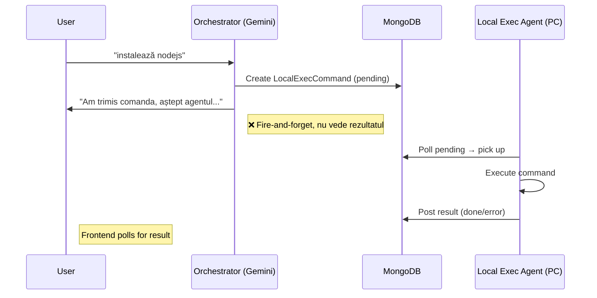
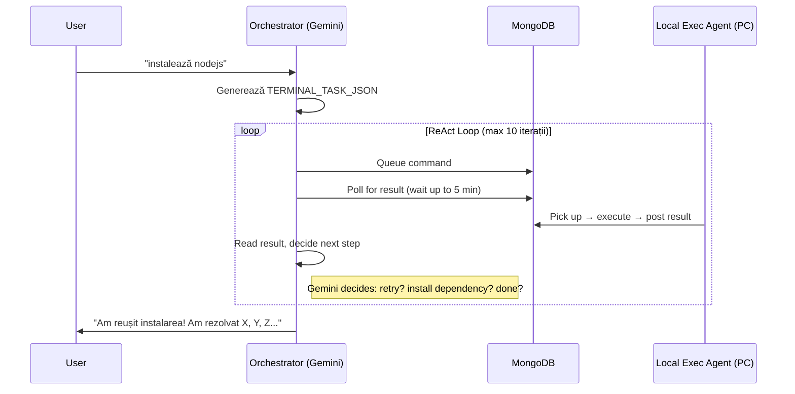

# Orchestrator Autonomous Terminal Execution (ReAct Loop)

Orchestratorul actual funcționează "fire-and-forget" pentru comenzi terminal: trimite o comandă → nu așteaptă rezultatul → răspunde imediat cu "Queued on local PC". Scopul este ca orchestratorul să poată executa **taskuri complexe autonome** (ex: "instalează Node.js"), așteptând rezultatul fiecărei comenzi, luând decizii pas cu pas, rezolvând probleme pe parcurs, și venind cu un raport final complet.

## Arhitectura Curentă (Analiză)



## Arhitectura Propusă



## Proposed Changes

### Backend Core

---

#### [MODIFY] [orchestratorService.js](file:///c:/Users/Admin/Documents/GitHub/usa-app/backend/orchestratorService.js)

**1. Adaugă noul tag `TERMINAL_TASK_JSON` în system prompt:**
- Format: `<TERMINAL_TASK_JSON>{"task":"Install Node.js","steps":["node --version","winget install OpenJS.NodeJS.LTS"]}</TERMINAL_TASK_JSON>`
- Instrucțiuni pentru Gemini: când primește un task terminal complex, să genereze acest tag
- Diferența față de `LOCAL_EXEC_JSON`: este un task autonom multi-step, nu o singură comandă

**2. Adaugă funcția `executeTerminalTask()` — ReAct Loop:**
- Primește task description + contextul conversației
- Execută un loop (max 10 iterații):
  1. **THINK**: Trimite starea curentă la Gemini → Gemini decide ce comandă să ruleze 
  2. **ACT**: Creează `LocalExecCommand` în MongoDB, apoi poll la fiecare 3s până primește rezultatul (timeout 5 min per comandă)
  3. **OBSERVE**: Citește output-ul, exit code-ul → alimentează următoarea iterație
  4. **DECIDE**: Gemini decide: mai e ceva de făcut? a apărut o eroare? trebuie retry?
- La final, Gemini generează un raport sumarizat

**3. Adaugă extractor + handler pentru `TERMINAL_TASK_JSON`:**
- [extractJSON(responseText, 'TERMINAL_TASK_JSON')](file:///c:/Users/Admin/Documents/GitHub/usa-app/backend/orchestratorService.js#168-174)
- În secțiunea de execute actions, apelează `executeTerminalTask()` când detectează tag-ul
- Rezultatul se salvează în chat history ca mesaj model

**4. Update [cleanAllTags()](file:///c:/Users/Admin/Documents/GitHub/usa-app/backend/orchestratorService.js#175-195) și [detectIntent()](file:///c:/Users/Admin/Documents/GitHub/usa-app/backend/orchestratorService.js#196-230):**
- Adaugă regex pentru `TERMINAL_TASK_JSON`
- Adaugă intent `terminal-task` cu prioritate mare

---

#### [MODIFY] [server.js](file:///c:/Users/Admin/Documents/GitHub/usa-app/backend/server.js)

- Nicio modificare de schemă necesară — refolosim `LocalExecCommand` existent
- Nicio rută nouă necesară — refolosim rutele existente

---

### Frontend

---

#### [MODIFY] [page.tsx](file:///c:/Users/Admin/Documents/GitHub/usa-app/frontend/src/app/orchestrator/page.tsx)

**1. Adaugă labelul `terminal-task` în `agentLabels`:**
```typescript
'terminal-task': { label: 'Terminal Task', color: 'bg-lime-100 text-lime-700 dark:bg-lime-900/40 dark:text-lime-300', icon: '⚡' },
```

**2. Afișează rezultatul terminal task inline:**
- Orchestratorul returnează deja `reply` cu raportul final
- Frontend-ul îl afișează ca mesaj normal cu badge-ul `terminal-task`

> [!IMPORTANT]
> Nicio schimbare majoră în frontend — răspunsul vine ca text simplu în `reply`, nu ca exec pendint. Streamingul pas cu pas (afișarea fiecărei comenzi în timp real) ar fi un upgrade viitor.

---

## Detalii Tehnice ale ReAct Loop

### Funcția `executeTerminalTask(taskDescription, sessionId)`

```javascript
async function executeTerminalTask(taskDescription, sessionId) {
    const maxIterations = 10;
    const commandTimeout = 5 * 60 * 1000; // 5 min per command
    const history = [];
    
    for (let i = 0; i < maxIterations; i++) {
        // 1. THINK — Ask Gemini what to do next
        const prompt = buildReActPrompt(taskDescription, history);
        const response = await geminiCall(prompt);
        
        // 2. Check if Gemini says DONE
        if (response.includes('<DONE>')) {
            return extractFinalReport(response);
        }
        
        // 3. ACT — Extract and execute command
        const cmd = extractJSON(response, 'CMD');
        const result = await executeAndWait(cmd.command, cmd.cwd, commandTimeout);
        
        // 4. OBSERVE — Record result
        history.push({ command: cmd.command, output: result.output, exitCode: result.exitCode });
    }
    
    return "Am atins limita de iterații. Iată ce am realizat: ...";
}
```

### Prompt ReAct (pentru Gemini în loop)

```
Ești un agent terminal autonom. Execuți un task pas cu pas pe PC-ul utilizatorului (Windows).

TASK: {taskDescription}

ISTORIC COMENZI:
{history.map(h => `$ ${h.command}\nExit: ${h.exitCode}\nOutput:\n${h.output}\n---`)}

INSTRUCȚIUNI:
- Analizează output-ul comenzii anterioare
- Dacă taskul e complet, răspunde cu <DONE>{raport final}</DONE>
- Dacă mai e ceva de făcut, generează următoarea comandă: <CMD>{"command":"...","cwd":"..."}</CMD>
- Dacă a apărut o eroare, încearcă s-o rezolvi autonom
- Sistem: Windows 10/11, PowerShell/CMD disponibil
```

## Verification Plan

### Manual Verification
Testarea se face manual prin UI-ul orchestratorului:

1. **Pornește local-exec-agent**: `node backend/local-exec-agent.js`
2. **Deschide orchestratorul**: navighez la `/orchestrator` 
3. **Testează un task simplu**: trimite "verifică dacă node.js este instalat pe PC-ul meu și spune-mi versiunea"
   - Orchestratorul ar trebui să execute `node --version`, citească output, și răspundă cu versiunea
4. **Testează un task cu eroare**: trimite "instalează pachetul npm cowsay global"
   - Orchestratorul ar trebui să execute `npm install -g cowsay`, verifice rezultatul, și raporteze succesul
5. **Verifică raportul final**: răspunsul trebuie să conțină detalii despre ce s-a întâmplat, ce probleme au apărut, ce s-a rezolvat

### Automated Verification
- Nu există teste unitare existente în proiect pentru orchestrator
- Verificarea principală este end-to-end prin UI
